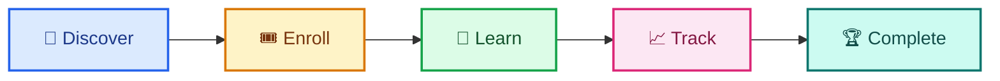
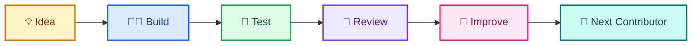
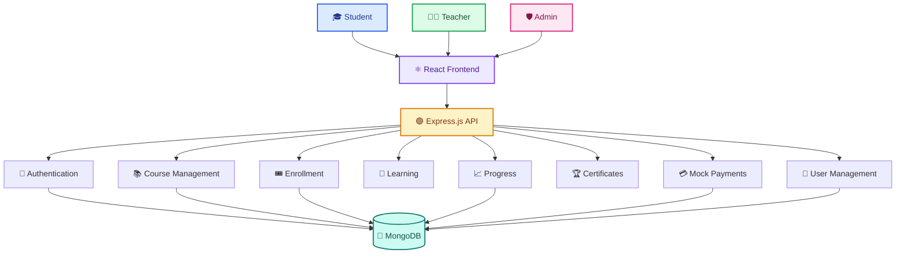

<div align="center">

# LearnHub 🎓

### An open-source e-learning platform built to learn, teach, and contribute.

**Learn something. Build something. Leave something better.**

<br/>

[](https://github.com/udaycodespace/learnhub/stargazers)
[](https://github.com/udaycodespace/learnhub/network/members)
[](https://github.com/udaycodespace/learnhub/graphs/contributors)
[](LICENSE)

<br/>

[](https://www.mongodb.com)
[](https://expressjs.com)
[](https://react.dev)
[](https://nodejs.org)
[](https://vitejs.dev)
[](https://www.docker.com)

</div>

> [!NOTE]
> **LearnHub is built in the open.** Whether you are here to learn, teach, fix, build, review, or simply explore, there is room to contribute.

## Why LearnHub? 🎯

Learning platforms look simple from the outside.

A student finds a course, clicks enroll, watches a lecture, tracks progress, and eventually receives a certificate.

But behind that experience are authentication, course management, enrollment, video delivery, progress tracking, certificates, payments, administration, and a codebase that other developers need to understand.

**LearnHub brings those pieces together in one open-source full-stack project.**

It is designed to be useful in two directions:

<div align="center">

|           For learners           |            For contributors           |
| :------------------------------: | :-----------------------------------: |
| 🎓 Discover and complete courses | 🧑‍💻 Explore a real MERN application |
|     🎥 Watch learning content    |  🔍 Understand existing architecture  |
|         📈 Track progress        |           🐛 Fix real issues          |
|       🏆 Earn certificates       |      ✨ Build meaningful features      |
|       👨‍🏫 Publish courses      |     🤝 Collaborate through GitHub     |

</div>

> [!IMPORTANT]
> **LearnHub is not trying to pretend that everything is finished.**
>
> The project is intentionally open to improvement, experimentation, and contribution.

## The Idea 💡

The core idea is straightforward:

**Make learning accessible while giving developers a real project to build on.**



But LearnHub has another journey happening underneath the learning flow:



**That second journey is what makes LearnHub open source.**

## What Problem Does It Tackle? 🧩

A useful learning platform needs more than a video player.

It needs to connect the entire learning journey.

<div align="center">

| Challenge                       | LearnHub Approach                 |
| :------------------------------ | :-------------------------------- |
| 🔎 Finding relevant learning    | Searchable course catalog         |
| 🎟️ Accessing courses           | Free and mock premium enrollment  |
| 🎥 Delivering content           | Integrated video learning flow    |
| 📈 Understanding progress       | Section-level progress tracking   |
| 🏆 Proving completion           | Certificate PDF generation        |
| 👨‍🏫 Managing teaching content | Teacher dashboard                 |
| 🛡️ Managing the platform       | Admin interface                   |
| 🤝 Improving the project        | Open-source contribution workflow |

</div>

LearnHub does not claim to solve every problem in online education.

Instead, it provides a practical foundation that developers can understand, extend, improve, and learn from.

## How It Fits Together 🏗️



## What You Can Do ✨

<div align="center">

|        🎓 Students       |    👨‍🏫 Teachers    |  🛡️ Administrators  |
| :----------------------: | :------------------: | :------------------: |
|     🔎 Browse courses    |   ➕ Create courses   |    👥 Manage users   |
|     🔍 Search courses    |   📝 Manage content  |   📚 Manage courses  |
|        🎟️ Enroll        |  🎥 Upload lectures  |  📊 View enrollments |
|     ▶️ Watch lectures    | 💰 Configure pricing |  🗑️ Remove courses  |
|     📈 Track progress    | 📊 Track enrollments |   🔐 Manage access   |
| 🏆 Download certificates |   🧰 Manage courses  | 🛡️ Moderate content |

</div>

## Student, Teacher & Admin Experience 🧑‍🤝‍🧑

### Student Experience

Students can:

* 🔎 Browse and search courses
* 🏷️ Explore courses by title or category
* 🎟️ Enroll in free courses
* 💳 Use the mock payment flow for premium courses
* 🎥 Watch uploaded lectures
* ✅ Mark learning sections as completed
* 📈 Track learning progress
* 🏆 Download a certificate after completion

### Teacher Experience

Teachers can:

* ➕ Create courses
* 📝 Add titles, descriptions, categories, and pricing
* 🎥 Upload `.mp4` lecture videos
* 📊 Monitor enrollment numbers
* 🧰 Manage courses they created
* 🗑️ Delete their own courses

### Admin Experience

Administrators can:

* 👥 View registered users
* 📚 Manage courses
* 🗑️ Remove courses from the platform
* 📊 View enrollment information

## Feature Status 🚦

<div align="center">

| Feature                  | Status | Current State       |
| :----------------------- | :----: | :------------------ |
| 🔎 Course discovery      |   🟢   | Available           |
| 🎟️ Enrollment           |   🟢   | Available           |
| 🎥 Video learning        |   🟢   | Local video storage |
| 📈 Progress tracking     |   🟢   | Available           |
| 🏆 Certificates          |   🟢   | PDF generation      |
| 👨‍🏫 Teacher dashboard  |   🟢   | Available           |
| 🛡️ Admin management     |   🟢   | Available           |
| 💳 Real payment gateway  |   🟡   | Planned             |
| ☁️ Cloud video hosting   |   🟡   | Planned             |
| 📋 Admin activity viewer |   🟡   | Planned             |
| 🚀 Production deployment |   🟡   | To be decided       |

</div>

> [!NOTE]
> **Status labels describe the current project state, not a promise of future delivery dates.**

## Technology Stack 🛠️

<div align="center">

|        Layer        | Technology  | Purpose                           |
| :-----------------: | :---------- | :-------------------------------- |
|     ⚛️ Frontend     | React       | Component-based application UI    |
|        🎨 UI        | Material UI | Interface components and controls |
|      🧱 Layout      | Bootstrap   | Responsive layouts and forms      |
|       ⚡ Build       | Vite        | Development and production builds |
|       🌐 HTTP       | Axios       | Frontend API communication        |
|      🟢 Runtime     | Node.js     | Backend runtime                   |
|        🔌 API       | Express.js  | Routes, middleware, controllers   |
|     🍃 Database     | MongoDB     | Persistent application data       |
|    🐳 Containers    | Docker      | Reproducible local environments   |
| 🧑‍💻 Collaboration | GitHub      | Issues, PRs, and reviews          |

</div>

## Project Structure 📁

```text
learnhub/
│
├── backend/
│   ├── config/
│   ├── controllers/
│   ├── middlewares/
│   ├── routers/
│   ├── schemas/
│   ├── seed.js
│   ├── .env
│   └── package.json
│
├── frontend/
│   ├── src/
│   │   ├── components/
│   │   ├── App.css
│   │   ├── App.jsx
│   │   └── main.jsx
│   └── package.json
│
├── assets/
├── CONTRIBUTING.md
├── SUPPORT.md
├── LICENSE
└── README.md
```

## Getting Started 🚀

Want to explore LearnHub locally?

The setup is intentionally straightforward.

### Prerequisites

<div align="center">

| Requirement |     Version    |
| :---------: | :------------: |
|  🟢 Node.js |       18+      |
|  🍃 MongoDB | Local or cloud |
|    🔧 Git   |  Latest stable |
|  🐳 Docker  |    Optional    |

</div>

### Clone the repository

```bash
git clone https://github.com/udaycodespace/learnhub.git
cd learnhub
```

### Install dependencies

```bash
cd backend
npm install

cd ../frontend
npm install
```

### Configure environment

Copy the example environment file:

```bash
cp backend/.env.example backend/.env
```

Configure the required values inside `.env`.

> [!WARNING]
> **Never commit credentials, API keys, database passwords, tokens, or other secrets to the repository.**

### Start the backend

```bash
cd backend
npm start
```

Backend:

```text
http://localhost:5000
```

### Start the frontend

Open another terminal:

```bash
cd frontend
npm run dev
```

Frontend:

```text
http://localhost:5173
```

### Seed development data

```bash
cd backend
node seed.js
```

## Local Development Accounts 🔐

<div align="center">

|      Role     | Email                   | Password             |
| :-----------: | :---------------------- | :------------------- |
|   🛡️ Admin   | `learn@learnhub.com`    | `changethispassword` |
| 👨‍🏫 Teacher | `teacher@learnhub.com`  | `teacherpassword`    |
|   🎓 Student  | `student1@learnhub.com` | `student1password`   |
|   🎓 Student  | `student2@learnhub.com` | `student2password`   |

</div>

> [!WARNING]
> These credentials are intended for **local development only**.

## Running with Docker 🐳

Start the services:

```bash
docker compose up --build
```

Stop the services:

```bash
docker compose down
```

Seed the database:

```bash
docker compose exec backend node seed.js
```

<div align="center">

|   Service   | Address                 |
| :---------: | :---------------------- |
| ⚛️ Frontend | `http://localhost:5173` |
|  🟢 Backend | `http://localhost:5000` |

</div>

## Available Scripts 🧰

### Backend

<div align="center">

| Command     | Purpose                    |
| :---------- | :------------------------- |
| `npm start` | Start backend with nodemon |

</div>

### Frontend

<div align="center">

| Command           | Purpose                          |
| :---------------- | :------------------------------- |
| `npm run dev`     | Start Vite development server    |
| `npm run build`   | Create production build          |
| `npm run preview` | Preview production build locally |

</div>

## Contribution Philosophy 🌱

LearnHub is not looking for contributions simply to increase a contributor count.

The better question is:

> **Does this make LearnHub better for the next person?**

That person might be:

* 🎓 A student using the platform
* 👨‍🏫 A teacher creating a course
* 🧑‍💻 A developer reading the code
* 🌱 A first-time contributor
* 🛡️ A future maintainer

A contribution can be:

* ✨ A feature
* 🐛 A bug fix
* 🧪 A test
* 📖 Documentation
* 🎨 UX improvement
* ♿ Accessibility work
* ⚡ Performance improvement
* 🔒 Security improvement
* 👀 A thoughtful code review

**Different contributions have different impact.**

They all matter.

## How Contributions Move 🤝

```mermaid
flowchart LR

    A["🔎 Find"] --> B["🧠 Understand"]
    B --> C["💬 Discuss"]
    C --> D["🔨 Build"]
    D --> E["🧪 Test"]
    E --> F["🚀 Pull Request"]
    F --> G["👀 Review"]
    G --> H["✨ Improve"]

    style A fill:#DBEAFE,stroke:#2563EB,stroke-width:2px,color:#1E3A8A
    style B fill:#EDE9FE,stroke:#7C3AED,stroke-width:2px,color:#4C1D95
    style C fill:#FEF3C7,stroke:#D97706,stroke-width:2px,color:#78350F
    style D fill:#DCFCE7,stroke:#16A34A,stroke-width:2px,color:#14532D
    style E fill:#FCE7F3,stroke:#DB2777,stroke-width:2px,color:#831843
    style F fill:#CCFBF1,stroke:#0F766E,stroke-width:2px,color:#134E4A
    style G fill:#E0E7FF,stroke:#4F46E5,stroke-width:2px,color:#312E81
    style H fill:#DCFCE7,stroke:#16A34A,stroke-width:2px,color:#14532D
```



The workflow is simple:

**Understand first → build carefully → test properly → open a PR → learn from review.**

## Where You Can Start 🌟

<div align="center">

|   🐛 Bug Fixes   |  🎨 Design |  🧪 Testing  |     📖 Documentation    |
| :--------------: | :--------: | :----------: | :---------------------: |
| Reproduce issues | Improve UX | Add coverage | Clarify confusing areas |

|     🔒 Security    |  ♿ Accessibility  |    ⚡ Performance   |         ✨ Features        |
| :----------------: | :---------------: | :----------------: | :-----------------------: |
| Improve safeguards | Make UX inclusive | Reduce bottlenecks | Build useful capabilities |

</div>

You do not need to start with the biggest issue.

A small, well-understood contribution is often the best way to learn the repository.

> [!TIP]
> **Start small. Understand the problem, make one focused change, and learn from the review.**

## Project Admin Support 🧑‍💼

If something does not make sense, **ask.**

You are not expected to understand the entire repository before making your first contribution.

As Project Admin, I can help contributors with:

<div align="center">

|      🧭 Navigation      |      🧠 Understanding      |  🔨 Implementation  |       👀 Review      |
| :---------------------: | :------------------------: | :-----------------: | :------------------: |
|   Find relevant files   |    Explain architecture    | Break down problems | Discuss improvements |
|   Understand structure  | Explain existing behaviour |     Debug issues    |   Refine approaches  |
| Find contribution paths |      Clarify decisions     |  Explore solutions  |  Improve PR quality  |

</div>

The goal is not simply to get a PR merged.

The goal is to help contributors understand **why** something works so they can confidently work on the next problem.

If your idea is not already represented by an issue, start a discussion before building something large.

## Roadmap 🗺️

<div align="center">

| Area                     |   Status   | Direction                   |
| :----------------------- | :--------: | :-------------------------- |
| 💳 Real payment gateway  | 🟡 Planned | Replace mock checkout       |
| ☁️ Cloud video hosting   | 🟡 Planned | Introduce Cloudinary        |
| 📋 Admin activity viewer | 🟡 Planned | Expose stored activity      |
| 🚀 Production deployment | 🟡 Planned | Decide hosting architecture |
| 🧪 Automated testing     |   🔵 Open  | Expand coverage             |
| ♿ Accessibility          |   🔵 Open  | Improve inclusive UX        |
| ⚡ Performance            |   🔵 Open  | Reduce unnecessary work     |
| ✨ Community features     |   🔵 Open  | Explore contributor ideas   |

</div>

The roadmap can evolve as the project and community evolve.

If you see a better direction, propose it.

## Open Source Programs 🌍

<a href="https://summerofcode.xyz/">


</a>

[](https://summerofcode.xyz/)

## Contributors 👥

### LearnHub is better because people showed up

Every contributor below has helped move the project forward.

Some contributions change behaviour.

Some fix bugs.

Some improve the interface.

Some make the infrastructure more reliable.

Some make the project easier for the next developer to understand.

> [!NOTE]
> **Different contributions. Different strengths. One shared project.**

<div align="center">

<!-- CONTRIBUTORS-START -->

<table>
<tr>

<td align="center" width="20%">

<a href="https://github.com/MOHITKOURAV01">

<br/><br/>
<b>MOHITKOURAV01</b>
</a>

<br/><br/>


</td>

<td align="center" width="20%">

<a href="https://github.com/Jidnyasa-P">

<br/><br/>
<b>Jidnyasa-P</b>
</a>

<br/><br/>


</td>

<td align="center" width="20%">

<a href="https://github.com/sujalv28">

<br/><br/>
<b>sujalv28</b>
</a>

<br/><br/>


</td>

<td align="center" width="20%">

<a href="https://github.com/teja-311">

<br/><br/>
<b>teja-311</b>
</a>

<br/><br/>


</td>

<td align="center" width="20%">

<a href="https://github.com/Taniya-H">

<br/><br/>
<b>Taniya-H</b>
</a>

<br/><br/>


</td>

</tr>

<tr>

<td align="center" width="20%">

<a href="https://github.com/Aryanbuha890">

<br/><br/>
<b>Aryanbuha890</b>
</a>

<br/><br/>


</td>

<td align="center" width="20%">

<a href="https://github.com/anshika-guleria">

<br/><br/>
<b>anshika-guleria</b>
</a>

<br/><br/>


</td>

<td align="center" width="20%">

<a href="https://github.com/sodium16">

<br/><br/>
<b>sodium16</b>
</a>

<br/><br/>


</td>

<td align="center" width="20%">

<a href="https://github.com/Hunter69240">

<br/><br/>
<b>Hunter69240</b>
</a>

<br/><br/>


</td>

<td align="center" width="20%">

<a href="https://github.com/Vachhani-Tapan">

<br/><br/>
<b>Vachhani-Tapan</b>
</a>

<br/><br/>


</td>

</tr>
</table>

<!-- CONTRIBUTORS-END -->

</div>

### Thank you for showing up

A contribution is more than a changed file.

It represents someone's **time, curiosity, effort, and willingness to work with a project they did not create.**

Whether you:

**🐛 Fixed something · ✨ Built something · 🧪 Tested something · 🎨 Improved something · 📖 Explained something · 👀 Reviewed something**

you helped move LearnHub forward.

> [!NOTE]
> **Thank you for being part of LearnHub.**

## New to Open Source? 📚

You do not need to be an expert before contributing.

Start with something understandable.

Read the code.

Ask questions.

Make a small change.

Learn from review.

Then take on something bigger.

<div align="center">

|              📚 GitHub Documentation             |                                 🔄 GitHub Flow                                 |                                      🔀 Pull Requests                                      |                                                🍴 Fork a Repository                                               |
| :----------------------------------------------: | :----------------------------------------------------------------------------: | :----------------------------------------------------------------------------------------: | :---------------------------------------------------------------------------------------------------------------: |
| [GitHub Documentation](https://docs.github.com/) | [GitHub Flow](https://docs.github.com/en/get-started/using-github/github-flow) | [Pull Requests](https://docs.github.com/en/pull-requests/collaborating-with-pull-requests) | [Fork a Repository](https://docs.github.com/en/pull-requests/collaborating-with-pull-requests/working-with-forks) |

</div>

## Need Help? 🆘

<div align="center">

|                           🐛 Found a Bug                          |                          💡 Have an Idea                          |                             💬 Want to Discuss                            |           🤝 Need Guidance           |
| :---------------------------------------------------------------: | :---------------------------------------------------------------: | :-----------------------------------------------------------------------: | :----------------------------------: |
| [Open an Issue](https://github.com/udaycodespace/learnhub/issues) | [Open an Issue](https://github.com/udaycodespace/learnhub/issues) | [Join Discussions](https://github.com/udaycodespace/learnhub/discussions) | [Read Contributing](CONTRIBUTING.md) |

</div>

## Project Maintainer 🧑‍💼

<div align="center">

<a href="https://github.com/udaycodespace">
  
</a>

<br/><br/>

### udaycodespace

[](https://github.com/udaycodespace)

Maintaining LearnHub, supporting contributors, reviewing ideas,<br/>
and helping the project grow in the open.

</div>

## License 📄

LearnHub is distributed under the **MIT License**.

See [`LICENSE`](LICENSE) for the complete license text.

[](LICENSE)

### Learn. Build. Contribute.

**Built in the open. Improved together.**

[](https://github.com/udaycodespace/learnhub)
